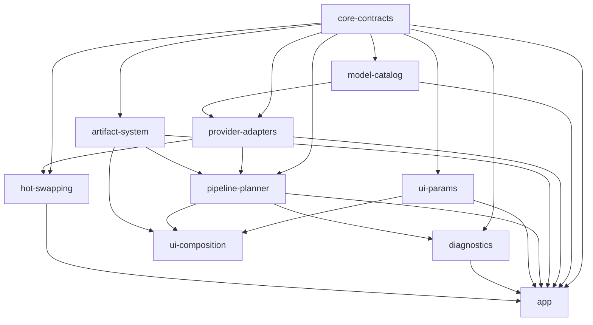

# Module Boundaries

This document defines the enforced module dependency rules and how to validate them.

## Rules

- UI modules must not depend on provider implementations.
- Provider adapters must not depend on UI modules.
- All Android modules must depend on `:core-contracts`.
- Circular dependencies are forbidden.
- Dependencies must stay within the approved graph.

## Dependency Graph

## Validation Tasks

- `./gradlew validateModuleBoundaries` validates rules and fails on violations.
- `./gradlew moduleDependencyReport` writes `build/reports/module-boundaries/module-dependency-report.txt`.
- `./gradlew moduleDependencyGraph` writes `build/reports/module-boundaries/module-dependency-graph.mmd`.
