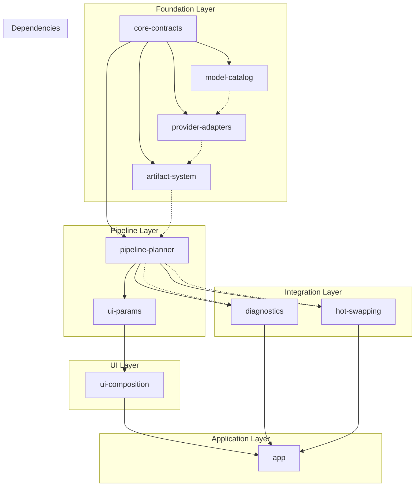
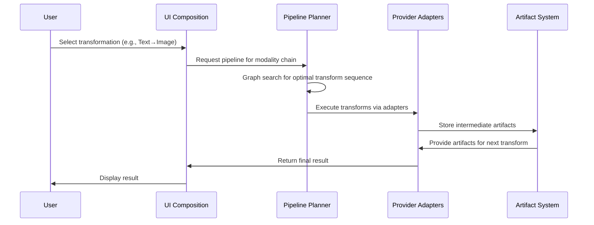

# Universal AI Pipeline Architecture Plan

## Overview

This document outlines the modular architecture for a provider-agnostic, capability-driven Android ecosystem where local and remote AI models are treated identically at runtime. The architecture emphasizes strict module boundaries, composable transformation pipelines, and hybrid sovereignty (local-first with cloud burst compute).

## Core Principles

- **Provider Agnostic**: Any provider (local or API) can be added without code changes
- **Capability-Driven**: Any model can be used for any modality it supports; UI adapts automatically
- **Composable Pipelines**: Text, image, video, and audio pipelines are graph-searched and automated
- **Parity**: Local models (GGUF, safetensors) and remote APIs treated identically at runtime
- **Strict Decoupling**: No tab contains provider-specific logic; no feature is hard-coded to an API

## Module Architecture

## Module Definitions

### Phase 0: Hard Contracts (`core-contracts`)

**Purpose**: Immutable interfaces and data structures that define the entire system's contract.

**Contents**:

- `Modality` sealed class hierarchy (Text, Image, Video, Audio)
- `Transform` sealed class hierarchy (TextToImage, ImageToVideo, etc.)
- `ModelDescriptor` data class with capabilities and metadata
- `ProviderExecutor` interface for unified execution
- `Capability` enum (TEXT, VISION, IMAGE_GEN, etc.)
- `ProviderId` enum (LOCAL_TEXT, OPENAI, LIQUID, etc.)

### Phase 1: Model Registry (`model-catalog`)

**Purpose**: Centralized model discovery and deduplication across multiple sources.

**Contents**:

- `ModelRegistry` with deduplication logic
- Multi-source discovery (Local filesystem, JSON configs, API endpoints)
- `ModelCatalogRepository` interface
- Model metadata caching and validation

### Phase 2: Provider Adapters (`provider-adapters`)

**Purpose**: Interchangeable plug-ins that normalize provider APIs.

**Contents**:

- `LocalLlama` adapter for GGUF models
- `Flux` adapter for image generation
- `OpenAICompatible` adapter for API providers
- `ProviderAdapterFactory` for runtime instantiation
- Unified execution interface

### Phase 3: Artifact System (`artifact-system`)

**Purpose**: I/O normalization with disk persistence and content URIs.

**Contents**:

- `Artifact` sealed class (TextArtifact, ImageArtifact, etc.)
- `ArtifactStore` for disk persistence
- `ContentUriHandler` for Android content URIs
- Type-safe artifact transformations

### Phase 4: Pipeline Planner (`pipeline-planner`)

**Purpose**: Graph search over transforms for automated pipeline composition.

**Contents**:

- `Graph search algorithm for transform chains`
- `PipelinePlanner` with Mermaid workflow documentation
- `PipelineExecutor` for execution orchestration
- Transform validation and optimization

### Phase 5: Dynamic UI (`ui-params`)

**Purpose**: Compose controls generated from model parameters.

**Contents**:

- `ModelParameter` data class with validation
- Compose control generators (sliders, text fields, etc.)
- `ParameterRegistry` for parameter discovery
- Dynamic form generation

### Phase 6: UI Composition (`ui-composition`)

**Purpose**: Tabs as transformation views with capability-driven adaptation.

**Contents**:

- Chat transformation view (Text → Text)
- Images transformation view (Text → Image, Image → Image)
- Video transformation view (Image → Video, Text → Video)
- Edit transformation view (universal parameter editor)

### Phase 7: Diagnostics (`diagnostics`)

**Purpose**: Structured error types and debug overlay for pipeline execution.

**Contents**:

- Structured error types with context
- Debug overlay for pipeline visualization
- `PipelineDiagnostics` for execution monitoring
- Performance metrics collection

### Phase 8: Hot-Swapping (`hot-swapping`)

**Purpose**: Config-driven provider addition/removal without rebuilds.

**Contents**:

- `ProviderConfigLoader` for JSON/YAML configs
- `ProviderHotSwapManager` for runtime management
- Provider lifecycle management
- Configuration validation

### Phase 9: Module Boundaries (`gradle-validation`)

**Purpose**: Enforced Gradle dependency checks preventing UI/Provider leakage.

**Contents**:

- Gradle validation tasks
- UI/Provider leakage detection
- Build-time boundary enforcement
- Dependency rule validation

## Pipeline Execution Flow

## Key Design Decisions

1. **Sealed Classes for Type Safety**: All core types use sealed classes to ensure exhaustive pattern matching
2. **Interface-Only Contracts**: `core-contracts` contains only interfaces and data classes, no implementations
3. **Capability-Driven Dispatch**: Models advertise capabilities, UI adapts based on available transforms
4. **Graph-Based Planning**: Pipeline composition uses graph search to find optimal transformation paths
5. **Artifact Normalization**: All I/O goes through the `Artifact` system for consistency
6. **Hot-Swappable Providers**: Runtime provider addition/removal via configuration
7. **Strict Module Boundaries**: Gradle enforces no circular dependencies or inappropriate imports

## Migration Strategy

1. **Phase 0-4**: Create new modules alongside existing code
2. **Phase 5-6**: Migrate UI components to use new architecture
3. **Phase 7-8**: Add diagnostics and hot-swapping
4. **Phase 9**: Enforce boundaries and remove old code

## Success Criteria

- ✅ Any provider can be added without touching UI code
- ✅ UI automatically adapts to model capabilities
- ✅ Pipelines compose automatically from available transforms
- ✅ Local and remote models treated identically
- ✅ No provider-specific logic in UI tabs
- ✅ Build fails if module boundaries are violated