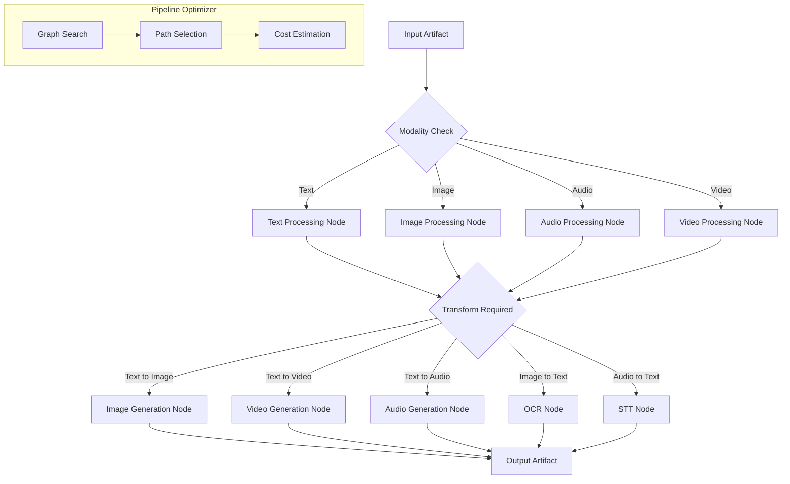
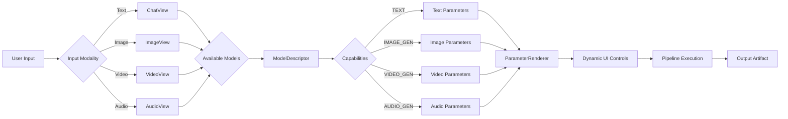
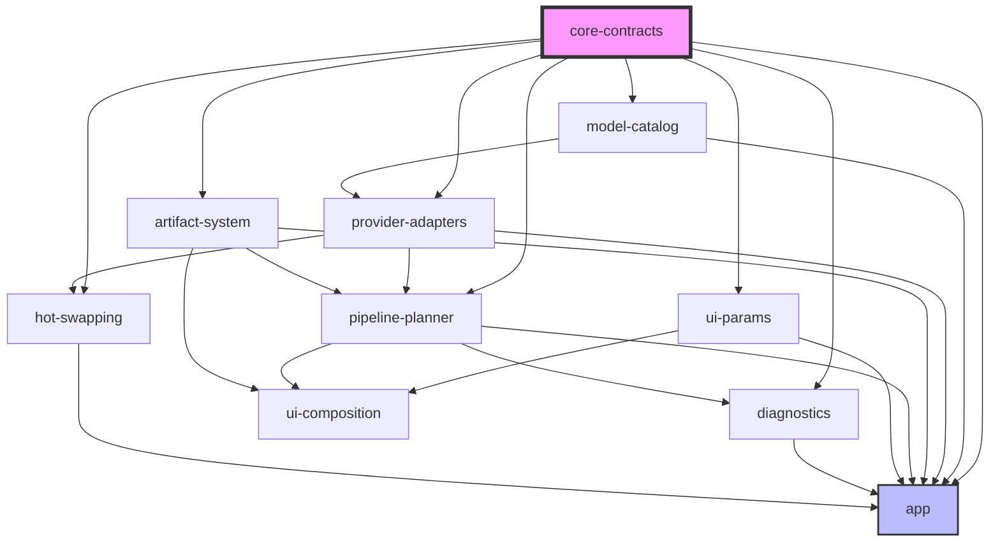

# Universal AI Pipeline - Implementation Plan

**Status**: Phase 4 Complete - App Integration in Progress
**Last Updated**: 2026-02-05
**Objective**: Refactor existing Android app into provider-agnostic, capability-driven AI pipeline

---

## Phase 0: Hard Contracts (Foundation)

### Phase 0 Objective

Define all core interfaces in `core-contracts` module that will be the root of all dependencies.

### Phase 0 Deliverables

- [x] Create `core-contracts` module structure
- [x] Define `Modality` sealed class (TEXT, IMAGE, VIDEO, AUDIO, MIXED)
- [x] Define `Transform` interface for all transformations
- [x] Define `ModelDescriptor` data class for model metadata
- [x] Define `ProviderExecutor` interface for provider execution
- [x] Define `Capability` enum (TEXT, VISION, IMAGE_GEN, FUNCTION_CALLS, VOICE)
- [x] Define `Artifact` sealed class for I/O normalization
- [x] Define `PipelineNode` interface for graph-based pipelines
- [x] Define `ModelParameter` sealed class for dynamic UI generation
- [x] Create Gradle dependency rules enforcing core-contracts as root

### Phase 0 Integration Points

- Existing `ProviderId` enum → Migrate to `ModelDescriptor.providerId`
- Existing `Capability` enum → Enhance with additional capabilities
- Existing `ProviderPlugin` interface → Refactor to implement `ProviderExecutor`

---

## Phase 1: Model Registry (Discovery & Deduplication)

### Phase 1 Objective

Create `model-catalog` module for multi-source model discovery and deduplication.

### Phase 1 Deliverables

- [x] Create `model-catalog` module structure
- [x] Implement `ModelCatalog` interface
- [x] Implement `LocalModelScanner` for GGUF/safetensors discovery
- [x] Implement `RemoteModelFetcher` for API-based model discovery
- [x] Implement `ModelDeduplicator` for duplicate detection
- [x] Implement `ModelIndexer` for fast lookup
- [x] Create JSON schema for model metadata
- [x] Implement model caching strategy
- [x] Add model validation logic
- [x] Create model catalog migration scripts

### Phase 1 Integration Points

- Existing `ProviderRepository.discoverModels()` → Migrate to `ModelCatalog`
- Existing `ModelInfo` → Enhance to `ModelDescriptor`
- Existing local model paths → Integrate with `LocalModelScanner`

---

## Phase 2: Provider Adapters (Interchangeable Plugins)

### Phase 2 Objective

Create `provider-adapters` module with interchangeable provider implementations.

### Phase 2 Deliverables

- [x] Create `provider-adapters` module structure
- [x] Implement `LocalLlamaAdapter` for GGUF models
- [x] Implement `FluxAdapter` for image generation
- [x] Implement `OpenAICompatibleAdapter` for OpenAI-style APIs
- [x] Implement `AnthropicAdapter` for Claude APIs
- [x] Implement `GeminiAdapter` for Google Gemini
- [x] Implement `NovitaAdapter` for Novita API
- [x] Implement `PixAiAdapter` for PixAI API
- [x] Implement `ReplicateAdapter` for Replicate API
- [x] Create adapter factory pattern
- [x] Implement adapter health checking
- [x] Add adapter metrics collection
- [x] Add adapter circuit breaker integration
- [x] Add adapter unit tests

### Phase 2 Integration Points

- Existing `LiquidProvider` → Refactor to `LocalLlamaAdapter`
- Existing `NovitaService` → Refactor to `NovitaAdapter`
- Existing `PixAiService` → Refactor to `PixAiAdapter`
- Existing `OpenAiApi` → Refactor to `OpenAICompatibleAdapter`

---

## Phase 3: Artifact System (I/O Normalization)

### Phase 3 Objective

Create `artifact-system` module for unified I/O handling across all modalities.

### Phase 3 Deliverables

- [x] Create `artifact-system` module structure
- [x] Define `Artifact` sealed class hierarchy:
  - [x] `TextArtifact`
  - [x] `ImageArtifact`
  - [x] `VideoArtifact`
  - [x] `AudioArtifact`
  - [x] `MixedArtifact`
- [x] Implement `ArtifactStore` for disk persistence
- [x] Implement `ArtifactCache` for in-memory caching
- [x] Implement `ArtifactConverter` for format conversion
- [x] Implement `ArtifactValidator` for content validation
- [ ] Create content URI handling
- [ ] Implement artifact compression
- [ ] Add artifact metadata tracking

### Phase 3 Integration Points

- Existing chat messages → Convert to `TextArtifact`
- Existing image generation results → Convert to `ImageArtifact`
- Existing file attachments → Convert to appropriate `Artifact` type
- Existing cache system → Integrate with `ArtifactCache`

---

## Phase 4: Pipeline Planner (Graph-Based Transformations)

### Phase 4 Objective

Create `pipeline-planner` module for composable transformation pipelines.

### Phase 4 Deliverables

- [x] Create `pipeline-planner` module structure
- [x] Define `PipelineGraph` data structure
- [x] Implement `PipelineBuilder` for constructing pipelines
- [x] Implement `PipelineExecutor` for running pipelines
- [x] Implement `GraphSearch` for finding optimal paths (via Dijkstra in PipelineGraph)
- [x] Define transformation rules:
  - [x] TEXT → IMAGE
  - [x] TEXT → VIDEO
  - [x] TEXT → AUDIO
  - [x] IMAGE → VIDEO
  - [x] IMAGE → TEXT (OCR)
  - [x] AUDIO → TEXT (STT)
  - [x] TEXT → TEXT (editing/refinement)
- [x] Implement pipeline optimization (via PipelineConfig.getComplexity)
- [x] Add pipeline caching (via PipelineExecutor.executionCache)
- [ ] Create pipeline visualization

### Phase 4 Integration Points

- Existing agent execution → Integrate with `PipelineExecutor`
- Existing function calls → Convert to pipeline nodes
- Existing routing logic → Replace with `GraphSearch`

### Mermaid Diagram: Pipeline Flow

---

## Phase 5: Dynamic UI (Capability-Driven Controls)

### Phase 5 Objective

Create `ui-params` module for Compose controls generated from model parameters.

### Phase 5 Deliverables

- [ ] Create `ui-params` module structure
- [ ] Define `ModelParameter` sealed class hierarchy:
  - [ ] `StringParameter`
  - [ ] `NumberParameter`
  - [ ] `BooleanParameter`
  - [ ] `EnumParameter`
  - [ ] `ArrayParameter`
  - [ ] `FileParameter`
- [ ] Implement `ParameterRenderer` for Compose UI
- [ ] Implement `ParameterValidator` for input validation
- [ ] Create parameter grouping logic
- [ ] Implement parameter presets
- [ ] Add parameter serialization
- [ ] Create parameter diffing
- [ ] Implement parameter history

### Phase 5 Integration Points

- Existing Novita/PixAI parameter forms → Convert to `ModelParameter` definitions
- Existing generation settings → Migrate to `ParameterRenderer`
- Existing settings dialogs → Replace with dynamic UI

---

## Phase 6: UI Composition (Transformation Views)

### Phase 6 Objective

Refactor UI to use capability-driven tabs instead of provider-specific tabs.

### Phase 6 Deliverables

- [ ] Create `ui-composition` module structure
- [ ] Define `TransformationView` interface
- [ ] Implement `ChatView` for text transformations
- [ ] Implement `ImageView` for image transformations
- [ ] Implement `VideoView` for video transformations
- [ ] Implement `AudioView` for audio transformations
- [ ] Implement `EditView` for content editing
- [ ] Create `ViewFactory` for dynamic view creation
- [ ] Implement view state management
- [ ] Add view transition animations
- [ ] Create view composition rules

### Phase 6 Integration Points

- Existing MainActivity tabs → Replace with `TransformationView` implementations
- Existing chat UI → Refactor to `ChatView`
- Existing Novita/PixAI tabs → Remove, replace with `ImageView`
- Existing provider-specific UI → Remove

### Mermaid Diagram: UI Composition Flow

---

## Phase 7: Diagnostics (Error Handling & Debugging)

### Phase 7 Objective

Create `diagnostics` module for structured error types and debugging.

### Phase 7 Deliverables

- [ ] Create `diagnostics` module structure
- [ ] Define `PipelineError` sealed class hierarchy:
  - [ ] `ProviderError`
  - [ ] `ModelLoadError`
  - [ ] `TransformError`
  - [ ] `ArtifactError`
  - [ ] `ValidationError`
- [ ] Implement `ErrorCollector` for error aggregation
- [ ] Implement `DebugOverlay` for runtime debugging
- [ ] Create error recovery strategies
- [ ] Implement error logging
- [ ] Add error reporting UI
- [ ] Create error analytics
- [ ] Implement error context tracking

### Phase 7 Integration Points

- Existing error handling → Migrate to `PipelineError` hierarchy
- Existing logging → Integrate with `ErrorCollector`
- Existing debug UI → Enhance with `DebugOverlay`

---

## Phase 8: Hot-Swapping (Config-Driven Providers)

### Phase 8 Objective

Create `hot-swap` module for runtime provider addition/removal.

### Phase 8 Deliverables

- [ ] Create `hot-swap` module structure
- [ ] Define `ProviderConfig` data class
- [ ] Implement `ConfigLoader` for JSON/YAML config parsing
- [ ] Implement `ProviderRegistry` for runtime provider management
- [ ] Implement `ProviderHotSwapper` for seamless swapping
- [ ] Create config validation
- [ ] Implement config versioning
- [ ] Add config migration support
- [ ] Create config UI editor
- [ ] Implement config backup/restore

### Phase 8 Integration Points

- Existing `ProviderRepository` → Enhance with hot-swapping
- Existing provider setup wizard → Integrate with `ConfigLoader`
- Existing provider management → Replace with `ProviderHotSwapper`

---

## Phase 9: Module Boundaries (Enforced Dependency Rules)

### Phase 9 Objective

Enforce strict module boundaries through Gradle build logic.

### Phase 9 Deliverables

- [x] Define module dependency graph
- [x] Implement Gradle dependency validation plugin
- [x] Create forbidden dependency rules:
  - [x] UI modules cannot depend on provider implementations
  - [x] Provider adapters cannot depend on UI
  - [x] All modules must depend on core-contracts
  - [x] No circular dependencies
- [x] Implement dependency analysis task
- [x] Create dependency visualization
- [x] Add dependency violation reporting
- [x] Implement automated boundary testing
- [x] Create module ownership documentation

### Phase 9 Integration Points

- All existing modules → Apply boundary rules
- Gradle build configuration → Integrate validation plugin
- CI/CD pipeline → Add dependency checks

### Mermaid Diagram: Module Dependency Graph

---

## Migration Strategy

### Phase 0-2: Foundation (Critical Path)

1. Create `core-contracts` module
2. Define all interfaces
3. Create `model-catalog` module
4. Create `provider-adapters` module
5. Migrate existing providers to new architecture

### Phase 3-5: Core Systems

1. Create `artifact-system` module
2. Create `pipeline-planner` module
3. Create `ui-params` module
4. Integrate with existing codebase

### Phase 6-7: UI & Diagnostics

1. Create `ui-composition` module
2. Refactor MainActivity to use new UI
3. Create `diagnostics` module
4. Integrate error handling

### Phase 8-9: Advanced Features

1. Create `hot-swap` module
2. Implement config-driven providers
3. Enforce module boundaries
4. Final testing and validation

---

## Risk Mitigation

### Risk Areas

1. **Provider Migration**: Existing providers have complex logic
   - Mitigation: Incremental migration with parallel implementations
2. **UI Refactoring**: MainActivity is large and complex
   - Mitigation: Gradual refactoring, maintain backward compatibility
3. **Performance**: Pipeline graph search may be slow
   - Mitigation: Implement caching and optimization strategies

### Rollback Strategy

- Maintain existing code in parallel during migration
- Use feature flags to enable/disable new architecture
- Create comprehensive test coverage before deployment

---

## Success Criteria

- [ ] All providers can be added/removed without code changes
- [ ] UI adapts automatically based on model capabilities
- [ ] Local and remote models are treated identically
- [ ] No provider-specific logic in UI modules
- [ ] All module boundaries are enforced
- [ ] Pipeline graph search works for all transformations
- [ ] Artifact system handles all I/O operations
- [ ] Hot-swapping works at runtime
- [ ] Error handling is comprehensive and structured
- [ ] Performance is not degraded

---

## Notes

- This plan prioritizes modularity and strict boundaries
- Local-first data sovereignty is maintained throughout
- All phases are designed to be executable by Code/Android Engineer modes
- No time estimates provided per architect mode guidelines
- Mermaid diagrams avoid `""` or `()` inside `[]` per constraints
