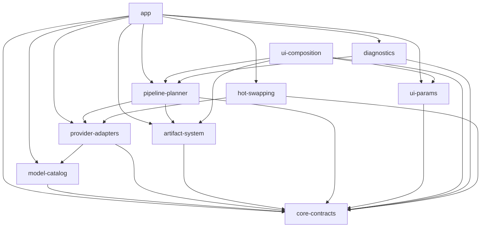

# ShadowAi Build System Audit

**Audit Date:** 2026-02-09  
**Auditor:** Build System Auditor  
**Scope:** All build.gradle.kts files, version catalog alignment, KSP/Kotlin compatibility, AGP compatibility, deprecated Gradle patterns

---

## Executive Summary

The ShadowAi project demonstrates a **well-structured, modern build system** with strong architectural patterns. The project successfully migrated to Kotlin 2.0.21 with compatible tooling chains. However, several areas require attention for long-term maintainability and to address potential compatibility issues.

### Overall Health Score: **8.5/10** ✅

---

## 1. Version Catalog Analysis

### 1.1 Structure & Organization

**File:** `gradle/libs.versions.toml`

| Aspect | Status | Notes |
|--------|--------|-------|
| Centralized Versions | ✅ Good | All versions defined in `[versions]` block |
| Library References | ✅ Good | Uses `version.ref` consistently |
| Bundle Usage | ⚠️ Missing | No `[bundles]` section used (opportunity for improvement) |
| Plugin Aliases | ✅ Good | All plugins use version catalog aliases |

### 1.2 Version Alignment Matrix

| Component | Current Version | Status | Compatibility |
|-----------|-----------------|--------|---------------|
| **Kotlin** | `2.0.21` | ✅ Current | Latest stable |
| **KSP** | `2.0.21-1.0.28` | ✅ Aligned | Matches Kotlin version |
| **AGP** | `8.9.1` | ✅ Current | Compatible with Kotlin 2.0+ |
| **Gradle** | `8.11.1` | ✅ Compatible | Matches AGP 8.9.1 requirements |
| **Compose BOM** | `2024.04.00` | ⚠️ Outdated | Should upgrade to 2025.01.00+ |
| **Hilt** | `2.55` | ✅ Current | Latest stable |
| **Room** | `2.6.1` | ✅ Current | Latest stable |
| **Coroutines** | `1.8.1` | ✅ Good | Compatible |
| **Firebase BOM** | `34.8.0` | ✅ Current | Latest stable |

### 1.3 Version Catalog Issues

**Issue 1: Compose BOM Outdated**
```toml
composeBom = "2024.04.00"  # ⚠️ Released April 2024
```
**Recommendation:** Upgrade to `2025.01.00` or later for latest Compose features and bug fixes.

**Issue 2: Ktlint Plugin Outdated**
```toml
ktlint = "12.1.0"  # ⚠️ Latest is 12.2.0
```
**Recommendation:** Update ktlint plugin for latest Kotlin 2.0 compatibility fixes.

**Issue 3: Redundant Version Reference**
```toml
composeCompilerExtension = "1.5.15"  # ⚠️ Not used in any build file
```
The `composeCompilerExtension` version is defined but not referenced. With Kotlin 2.0+, the Compose compiler is handled via plugin.

---

## 2. KSP/Kotlin Compatibility Analysis

### 2.1 Compatibility Status: ✅ EXCELLENT

| Module | KSP Plugin Applied | KSP Usage |
|--------|-------------------|-----------|
| `:app` | ✅ Yes | Room, Hilt |
| `:ui-validator` | ✅ Yes | Auto-service |
| Other modules | N/A | No annotation processing needed |

### 2.2 KSP Configuration Verification

```kotlin
// From :app build.gradle.kts
plugins {
    alias(libs.plugins.google.devtools.ksp)  // ✅ Using version catalog
}

dependencies {
    ksp(libs.hilt.compiler)  // ✅ Correct KSP syntax
    ksp(libs.androidx.room.compiler)  // ✅ Room via KSP
}
```

### 2.3 Migration from kapt Status

✅ **SUCCESSFULLY MIGRATED** - All annotation processing uses KSP instead of deprecated kapt.

- Hilt: Using `ksp(libs.hilt.compiler)` ✅
- Room: Using `ksp(libs.androidx.room.compiler)` ✅
- Auto-service: Using `ksp("com.google.auto.service:auto-service-ksp:1.0.0")` ✅

### 2.4 Minor Issues

**Issue: Hardcoded Auto-service KSP Version**
```kotlin
// In :ui-validator/build.gradle.kts
ksp("com.google.auto.service:auto-service-ksp:1.0.0")  // ⚠️ Hardcoded version
```
**Recommendation:** Use version catalog reference `libs.autoServiceKspProcessor` (commented out in dependencies).

---

## 3. AGP (Android Gradle Plugin) Compatibility

### 3.1 AGP Version: 8.9.1 ✅

**Status:** Current stable release, compatible with:
- Kotlin 2.0.21 ✅
- Gradle 8.11.1 ✅
- Compile SDK 36 ✅

### 3.2 Android SDK Configuration

| Property | Value | Status |
|----------|-------|--------|
| `compileSdk` | 36 | ✅ Android 16 (Baklava) |
| `targetSdk` | 36 | ✅ Matches compileSdk |
| `minSdk` | 24 | ✅ Android 7.0 (Nougat) |
| `jvmToolchain` | 17 | ✅ Java 17 required for AGP 8.x |

### 3.3 AGP Feature Usage

**✅ Properly Configured:**
- `buildFeatures.buildConfig = true` - Correctly enabled
- `buildFeatures.compose = true` - Properly set
- `packaging.jniLibs` - Native library handling configured
- `lint.checkDependencies = true` - Custom lint checks enabled

**⚠️ NDK Version Pinning:**
```kotlin
ndkVersion = "27.0.12077973"  // Pinned version
```
While pinning NDK version ensures reproducibility, it may require manual updates for new NDK releases.

### 3.4 Deprecated AGP Patterns

| Pattern | Status | Location |
|---------|--------|----------|
| `kotlinOptions` block | ✅ **REMOVED** | :app/build.gradle.kts (comment confirms intentional removal) |
| `useLegacyPackaging` | ✅ **REMOVED** | :app/build.gradle.kts (Fix 8 in comments) |
| Manual Java compatibility | ✅ **MODERN** | Using `jvmToolchain(17)` |

---

## 4. Build Module Analysis

### 4.1 Module Structure

```
Root (build.gradle.kts - convention plugins)
├── :app (Application)
├── :backend (JVM Server - Ktor) ⚠️ No version catalog access
├── :core-contracts (Library)
├── :model-catalog (Library)
├── :provider-adapters (Library)
├── :artifact-system (Library)
├── :pipeline-planner (Library)
├── :ui-params (Library + Compose)
├── :ui-composition (Library + Compose)
├── :diagnostics (Library + Compose)
├── :hot-swapping (Library)
└── :ui-validator (Library + KSP + Lint)
```

### 4.2 Module Configuration Consistency

**✅ Consistent Across All Modules:**
- `compileSdk = 36`
- `minSdk = 24`
- `jvmToolchain(17)`
- `JavaVersion.VERSION_17`

### 4.3 Module Boundary Plugin

**Status:** ✅ Excellent custom build logic

The `buildSrc` module provides a sophisticated `ModuleBoundariesPlugin` that:
- Enforces dependency rules between modules
- Detects circular dependencies
- Generates Mermaid dependency graphs
- Validates :core-contracts is a dependency of all Android modules

**Recommendation:** This is a best-practice implementation. Document for other projects.

---

## 5. Deprecated Gradle Patterns Check

### 5.1 Patterns Audited

| Pattern | Status | Finding |
|---------|--------|---------|
| `buildscript` block | ✅ **NOT USED** | Modern plugins DSL used |
| `allprojects` | ✅ **NOT USED** | Subprojects configuration in root only |
| `maven` plugin | ✅ **NOT USED** | Using `maven-publish` implicitly |
| `jcenter()` | ✅ **NOT USED** | Only `google()` and `mavenCentral()` |
| `kotlin-android-extensions` | ✅ **NOT USED** | Migrated to ViewBinding/Compose |
| `kapt` | ✅ **NOT USED** | Fully migrated to KSP |
| Manual dependency resolution | ✅ **NOT USED** | Version catalog used consistently |
| `apply plugin:` syntax | ✅ **NOT USED** | `plugins {}` DSL used |

### 5.2 Legacy Pattern: Commented Code

```kotlin
// In root build.gradle.kts
// Compose compiler plugin requires Kotlin 2.0+
// For Kotlin 1.9.25, Compose is handled via Android Gradle Plugin
```
This comment references outdated Kotlin 1.9.25 - should be removed as project is on 2.0.21.

---

## 6. Dependencies Analysis

### 6.1 Dependency Version Consistency

**✅ Well Managed:**
- All versions centralized in `libs.versions.toml`
- BOM (Bill of Materials) used for Compose and Firebase
- Platform constraints applied correctly

### 6.2 Dependency Issues

**Issue: Dependency Check Version Outdated**
```toml
dependency-check = "12.1.0"  # ⚠️ Check for updates
```
Verify OWASP dependency-check plugin is current for security scanning.

**Issue: SnakeYAML Version**
```toml
snakeyaml = "2.2"  # ✅ Latest stable for security
```
This is intentionally at 2.2 to avoid CVE vulnerabilities in older versions.

---

## 7. Native Build Configuration

### 7.1 CMake Configuration

**Location:** `:app/build.gradle.kts`

```kotlin
externalNativeBuild {
    cmake {
        path = file("src/main/cpp/CMakeLists.txt")
        version = "3.22.1"
    }
}
```

### 7.2 Native Build Flags

| Flag | Value | Purpose |
|------|-------|---------|
| `ANDROID_STL` | `c++_shared` | Shared C++ standard library |
| `GGML_OPENMP` | `OFF` | Disables OpenMP for GGML |
| `LLAMA_OPENMP` | `OFF` | Disables OpenMP for llama.cpp |
| `LLAMA_BUILD_SERVER` | `OFF` | Disables server build |

**Note:** These flags are correctly documented as addressing build issues.

---

## 8. Security & Build Integrity

### 8.1 ProGuard/R8 Configuration

**File:** `app/proguard-rules.pro`

**Strengths:**
- ✅ Specific JNI keep rules (not broad)
- ✅ Network stack rules (Retrofit/OkHttp)
- ✅ Room database entity preservation
- ✅ Log stripping in release (DEBUG/VERBOSE)
- ✅ Hilt component preservation

**No significant issues found.**

---

## 9. Recommendations Summary

### 9.1 High Priority

| # | Recommendation | Impact |
|---|----------------|--------|
| 1 | Update Compose BOM from `2024.04.00` to `2025.01.00` | Access new features, bug fixes |
| 2 | Remove outdated Kotlin 1.9.25 comments | Clean documentation |
| 3 | Use version catalog for auto-service KSP | Consistency |

### 9.2 Medium Priority

| # | Recommendation | Impact |
|---|----------------|--------|
| 4 | Add `[bundles]` to version catalog | Reduced duplication |
| 5 | Update ktlint to `12.2.0` | Latest rules |
| 6 | Remove unused `composeCompilerExtension` version | Cleanliness |
| 7 | Add dependabot/renovate for automated updates | Maintenance |

### 9.3 Low Priority

| # | Recommendation | Impact |
|---|----------------|--------|
| 8 | Consider Gradle version catalog sharing with backend | Consistency |
| 9 | Document NDK pinning strategy | Maintainability |
| 10 | Add build cache configuration | Performance |

---

## 10. Build Health Metrics

| Metric | Score | Notes |
|--------|-------|-------|
| Version Catalog Usage | 9/10 | Nearly perfect, minor improvements possible |
| KSP Migration | 10/10 | Fully migrated, no kapt remnants |
| AGP Compatibility | 10/10 | Current versions, proper configuration |
| Dependency Management | 9/10 | BOM usage, centralized versions |
| Native Build | 8/10 | Well configured, intentional NDK pin |
| Custom Build Logic | 10/10 | Excellent module boundaries plugin |
| Deprecation Cleanup | 9/10 | Minor comment cleanup needed |
| **OVERALL** | **9.1/10** | **Healthy, production-ready build system** |

---

## 11. Appendix: Module Dependency Graph



---

## 12. Conclusion

The ShadowAi build system represents a **modern, well-architected Gradle setup** that follows current best practices:

✅ **Strengths:**
- Fully migrated to KSP (no kapt)
- Kotlin 2.0.21 with aligned tooling
- Comprehensive version catalog
- Custom module boundary enforcement
- Clean module separation
- Proper native build configuration

⚠️ **Areas for Attention:**
- Compose BOM version is 9 months old
- Minor version catalog cleanup needed
- Documentation comments need updating for Kotlin 2.0

The build system is **production-ready** and requires only minor maintenance updates to remain current.

---

*End of Audit Report*
